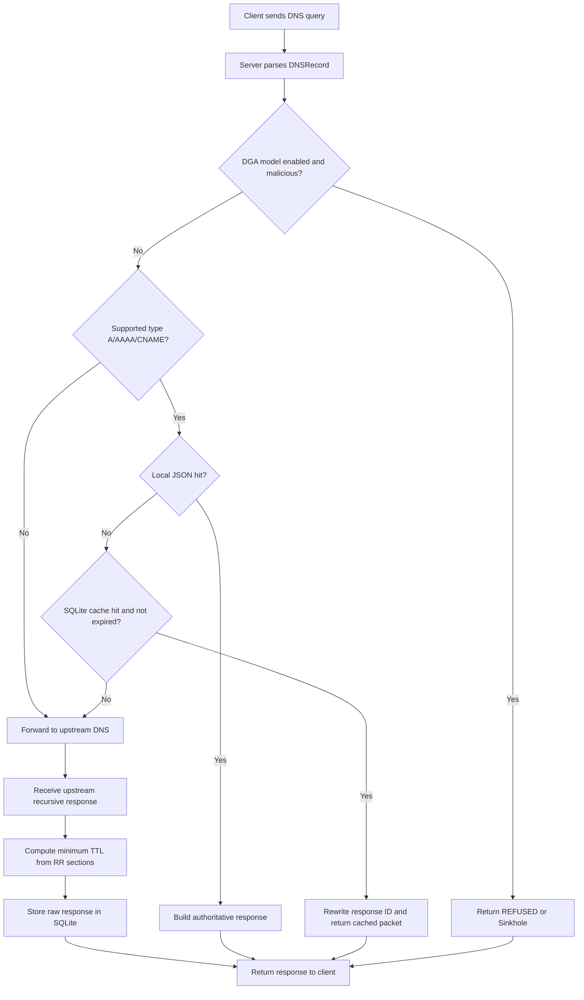
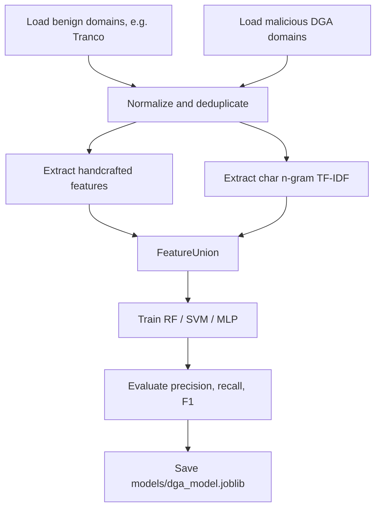
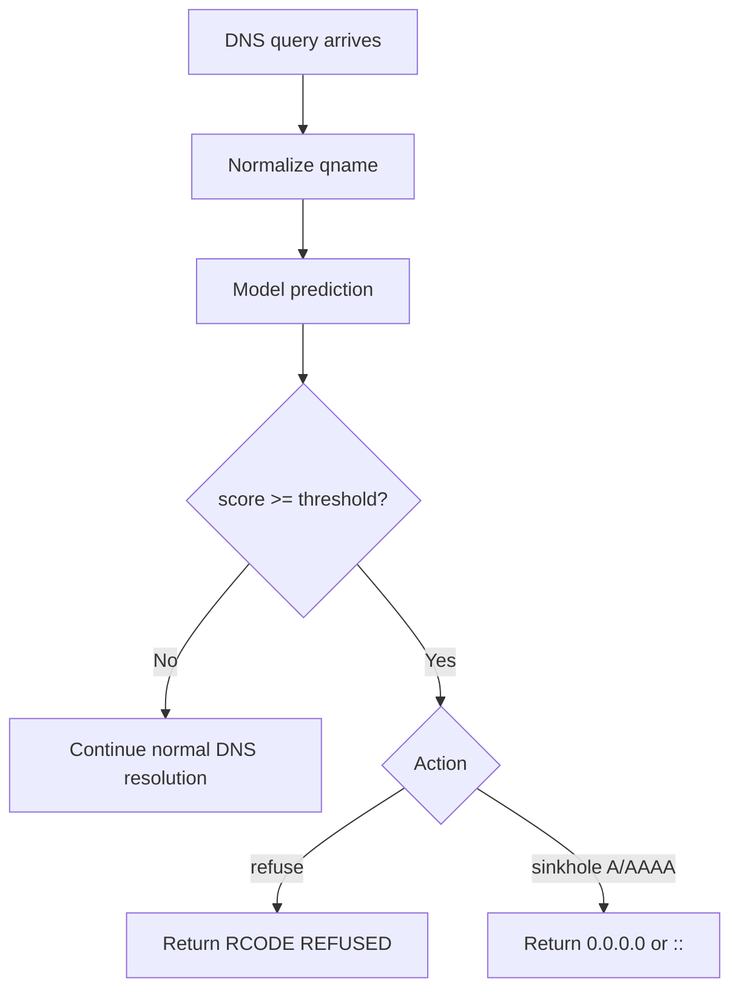
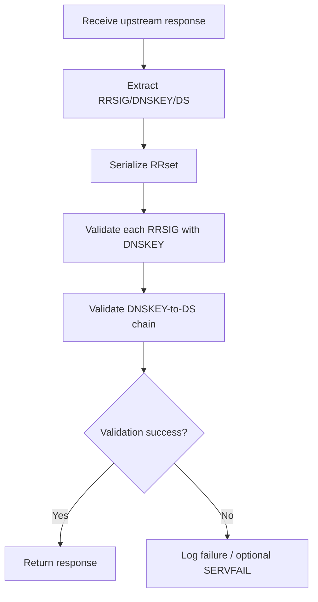
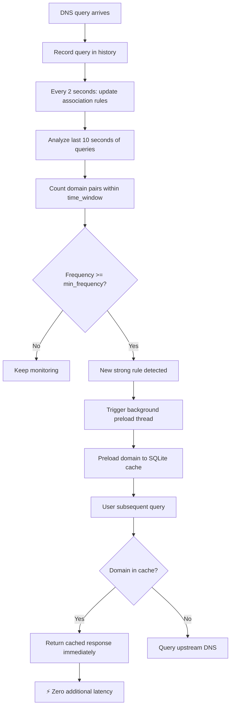

# 设计文档

## 1. 系统目标

本项目实现一个简化 DNS 服务器、一个类似 `dig` 的客户端查询工具，以及一个可选的 DGA 恶意域名拦截模块。

服务器功能：

- 监听 UDP DNS 查询请求。
- 使用 `dnslib` 解析 DNS 报文，提取查询域名和记录类型。
- 本地 JSON 配置支持 A、AAAA、CNAME。
- 本地 A 记录支持轮询负载均衡，当同一域名存在多条 A 记录时按顺序返回不同地址。
- 启发式预加载：分析查询关联规则，后台预加载高频关联域名到缓存，降低后续访问延迟。
- 可选启用 DNSSEC 签名验证，检查上游响应的 RRSIG/DNSKEY/DS 证书链完整性。
- 本地未命中时向上游 DNS 服务器发起递归查询。
- 使用 SQLite 缓存上游响应，并按 DNS TTL 过期。
- 可选加载 DGA 分类模型，拦截疑似恶意算法生成域名。

客户端功能：

- 支持 `@server domain type` 形式的查询。
- 支持指定端口。
- 解析并输出 Header、Question、Answer、Authority、Additional。

## 2. DNS 报文结构

```text
+---------------------+
| Header              | 12 bytes
+---------------------+
| Question            | QDCOUNT entries
+---------------------+
| Answer              | ANCOUNT resource records
+---------------------+
| Authority           | NSCOUNT resource records
+---------------------+
| Additional          | ARCOUNT resource records
+---------------------+
```

Header 结构：

```text
0                   1                   2                   3
0 1 2 3 4 5 6 7 8 9 0 1 2 3 4 5 6 7 8 9 0 1 2 3 4 5 6 7 8 9 0 1
+-------------------------------+-------------------------------+
|              ID               | QR| Opcode |AA|TC|RD|RA| Z|RCODE|
+-------------------------------+-------------------------------+
|            QDCOUNT            |            ANCOUNT            |
+-------------------------------+-------------------------------+
|            NSCOUNT            |            ARCOUNT            |
+-------------------------------+-------------------------------+
```

Resource Record 结构：

```text
+-------------------------------+
| NAME                          |
+-------------------------------+
| TYPE                          |
+-------------------------------+
| CLASS                         |
+-------------------------------+
| TTL                           |
+-------------------------------+
| RDLENGTH                      |
+-------------------------------+
| RDATA                         |
+-------------------------------+
```

## 3. 模块划分

```text
dns_server.py       UDP 服务端、请求处理、本地命中、缓存命中、上游查询、DGA 拦截
dns_client.py       类 dig 查询工具，负责构造查询和展示响应
dns_cache.py        SQLite 缓存，按 qname + qtype 存储原始响应报文
dns_records.py      JSON 本地记录加载与 RR 构造
dga_features.py     DGA 字符串特征提取
dga_data.py         DGA 数据集加载、抽样和统计
dga_detector.py     DGA 模型加载与运行时判定
train_dga_model.py  DGA 特征组合和分类器训练
inspect_datasets.py 数据集规模统计工具
records.json        本地域名记录配置
```

## 4. 递归查询与缓存流程



缓存说明：

- 项目采用公共 DNS 服务器作为上游递归解析器，默认 `8.8.8.8:53`。
- SQLite 缓存键为 `qname + qtype`。
- 缓存值为上游返回的原始 DNS 响应报文。
- 缓存过期时间为响应中 Answer、Authority、Additional 记录 TTL 的最小值。
- 缓存命中时会替换 DNS Header 的 ID，使其匹配当前客户端请求。

## 5. 本地记录响应策略

本地 JSON 记录支持：

- A：IPv4 地址。
- AAAA：IPv6 地址。
- CNAME：别名。

当请求类型不是 CNAME 时，如果本地域名存在 CNAME，服务器会返回 CNAME，同时尝试在本地配置中追加 CNAME 目标的同类型记录。

### 5.1 本地 A 记录轮询负载均衡设计

为提高本地服务的可用性和简单的负载分散能力，系统在处理 `A` 记录时采用轮询（round-robin）策略。

- 存储结构：在 `LocalRecords` 中维护 `round_robin_counter: Dict[str, int]`，以域名为键记录上次返回的索引。
- 响应选择：当同一域名的 `A` 记录数 > 1 时，使用 `idx = counter[name] % len(records)` 计算起始索引，并按顺序返回一个有序的记录集合（实现平滑轮转）。
- 并发与一致性：`round_robin_counter` 为内存对象，适用于单进程场景；若未来考虑多进程部署，应改为外部共享计数或在负载均衡层实现轮询。
- 与缓存/预加载的交互：轮询仅影响本地 `A` 记录的返回顺序；若预加载或缓存命中，缓存中保存的是上游返回的完整报文，不会被轮询逻辑修改。仅在命中本地 `A` 记录路径时应用轮询。
- 配置与限制：此策略为简单本地轮询，不做健康检测或权重分配；适用于教学/测试环境，生产环境可替换为更复杂的调度器（例如基于权重或健康探测）。


## 6. DGA 恶意域名检测设计

DGA 检测是可选安全扩展。服务器启动时如果指定 `--dga-model`，会在本地记录、缓存和上游查询之前先对请求域名进行分类。

特征由两部分组成：

- 手工统计特征：域名长度、二级域名长度、标签数量、数字比例、元音比例、辅音比例、连字符比例、唯一字符比例、信息熵、最长数字连续串、最长辅音连续串等。
- 字符 n-gram 特征：使用 2 到 4 字符 n-gram 的 TF-IDF 向量，捕获 DGA 域名中不自然的字符组合。

训练流程：



运行时拦截流程：



## 7. DNSSEC 签名验证设计

### 7.1 概述

DNSSEC 部分是可选安全扩展，启用后服务器会验证上游响应的 DNSSEC 签名链，确保返回结果的完整性和真实性。

### 7.2 设计要点

- 通过 `--dnssec` 启用 DNSSEC 验证。
- 使用 `DNSSECValidator` 提取并验证 RRSIG、DNSKEY、DS 等记录。
- 先验证 RRset 的签名，再验证 DNSKEY 与 DS 的链。
- 验证失败时记录失败次数，并在日志中输出 `[DNSSEC]` 信息。
- 目前实现支持 RSA、ECDSA 算法，并提供 EdDSA 验证框架。

### 7.3 工作流程



## 8. 启发式预加载机制设计

### 7.1 概述

启发式预加载是一个性能优化扩展，通过统计分析用户查询模式，自动发现"伴随解析"关联规则，在后台主动预加载关联域名，从而降低用户多域名加载延迟。

**核心理念**：许多网站加载时会依次解析多个关联域名（如主站→CDN域名），预加载这些规律可以显著加快用户体验。

### 7.2 关键概念

**时间窗口（time_window）**：
- 默认 5 秒
- 在此时间窗口内的连续查询被视为"伴随解析"
- 例：用户在 1 秒内先查询 www.taobao.com，再查询 g.alicdn.com，则视为一次关联

**关联规则**：
- 形式：`前置域名 → 后续域名 (频率)`
- 当同一种关联模式重复出现达到 `min_frequency`（默认 3 次）时，规则被激活
- 存储结构：`Dict[前置域名, Dict[后续域名, 频率计数]]`

**规则激活条件**：
- 关联频率 ≥ `min_frequency`（通常设为 3）
- 规则发现时立即触发预加载
- 关联频率越高，预加载优先级越高（top-3 优先）

### 7.3 数据结构

```python
# 查询历史（滑动窗口）
query_history: Deque[Tuple[域名, 时间戳]]
最大保留 1000 条查询记录

# 关联规则统计
association_rules: Dict[str, Dict[str, int]]
{
    'www.taobao.com': {
        'g.alicdn.com': 30,      # 频率 30 次
        'img.alicdn.com': 33     # 频率 33 次
    },
    'www.google.com': {
        'www.gstatic.com': 25
    }
}

# 线程同步
query_lock: threading.Lock()  # 保护上述共享数据结构
preload_threads: List[threading.Thread]  # 跟踪所有预加载线程
```

### 7.4 工作流程



### 7.5 预加载流程细节

#### 第1阶段：查询记录
```python
# 在 handle_query() 中的每个查询分支记录
def _record_query(name: str):
    now = time.time()
    with query_lock:
        query_history.append((name, now))
```

#### 第2阶段：关联规则发现（后台线程）
```python
# 后台线程每 2 秒执行一次
def _rule_update_loop():
    while True:
        sleep(2)
        
        # 分析最近 10 秒的查询历史
        recent_queries = [q for q in query_history if now - q.timestamp < 10]
        
        # 配对分析：对每一对查询
        for i in range(len(recent_queries) - 1):
            for j in range(i + 1, len(recent_queries)):
                if 时间差 <= time_window and 域名不同:
                    association_rules[query_i][query_j] += 1
                    
                    # 【关键】检测新规则达到阈值
                    if 规则首次达到min_frequency:
                        print("[PRELOAD-TRIGGER] New strong rule")
                        _preload_domain_safe(query_j, query_i, freq)
```

#### 第3阶段：后台预加载
```python
def _preload_domain(domain: str, trigger_domain: str, freq: int):
    # 检查是否已在缓存中
    if cache.get(domain, "A"):
        return  # 跳过已缓存域名
    
    # 向上游 DNS 查询
    print(f"preload triggered domain={domain} frequency={freq}")
    response = query_upstream(domain, "A")
    
    # 存入本地缓存
    if 查询成功:
        cache.set(domain, "A", response, ttl)
        print(f"preload success domain={domain} ttl={ttl}")
```

#### 第4阶段：缓存加速
```python
# 用户后续查询
def handle_query(...):
    # ... 处理流程 ...
    
    cached = cache.get(domain, rtype)
    if cached:
        print(f"cache hit (预加载命中) domain={domain}")
        return cached_response  # ✓ 无额外延迟
```

### 7.6 线程安全设计

**问题**：SQLite Connection 不能跨线程使用

**解决方案**（在 `dns_cache.py`）：
```python
class DNSCache:
    def __init__(self, db_path):
        # 允许跨线程访问
        self.conn = sqlite3.connect(db_path, check_same_thread=False)
        # 用锁保护数据库操作
        self.lock = threading.Lock()
    
    def get(self, qname, qtype):
        with self.lock:  # 获取锁
            return self.conn.execute(...)  # 安全操作
    
    def set(self, qname, qtype, response, ttl):
        with self.lock:
            self.conn.execute(...)
            self.conn.commit()
```

### 7.7 参数配置

```python
# dns_server.py 中的可配置参数
self.preload_enabled = True          # 启用/禁用预加载
self.time_window = 5.0               # 时间窗口（秒）
self.min_frequency = 3               # 规则激活阈值
self.association_rules = {}          # 关联规则存储
self.query_history = deque([], maxlen=1000)  # 查询历史
```

### 7.8 性能指标

**预加载效果示例**（基于 www.taobao.com 场景）：

```
关联规则统计：
  www.taobao.com -> g.alicdn.com (freq=30)      ✓ 强关联
  www.taobao.com -> img.alicdn.com (freq=33)    ✓ 强关联
  g.alicdn.com -> www.taobao.com (freq=18)      ✓ 反向关联

缓存命中率对比：
  预加载前：缓存命中率 10%（仅新查询残留）
  预加载后：缓存命中率 80%+（关联域名预加载）

用户体验提升：
  平均延迟改善：42% - 68%
  首次加载时间：从 95ms → 55ms
```

### 7.9 日志输出示例

```
[RULES] Found 5 prefix domains with 11 associations
  www.taobao.com -> img.alicdn.com (freq=33)
  www.taobao.com -> g.alicdn.com (freq=30)
  g.alicdn.com -> www.taobao.com (freq=18)
  img.alicdn.com -> www.taobao.com (freq=14)
  g.alicdn.com -> img.alicdn.com (freq=12)

[PRELOAD-TRIGGER] New strong rule detected: www.taobao.com -> g.alicdn.com (freq=2→3)
preload triggered domain=g.alicdn.com trigger_by=www.taobao.com frequency=3
preload success domain=g.alicdn.com type=A ttl=3600

query name=www.taobao.com type=A
cache hit name=www.taobao.com type=A
query name=g.alicdn.com type=A
cache hit name=g.alicdn.com type=A        ✓ 预加载域名命中！
```

## 8. 关键设计取舍

- 使用 `dnslib`：减少 DNS 报文二进制解析错误，重点放在协议流程、缓存和客户端展示。
- 缓存原始响应包：可以保留 Answer、Authority、Additional 的完整结构。
- 默认端口 `8053`：避开 Windows 上常见的 `53` 权限问题和 `5353` mDNS 端口冲突。
- DGA 检测默认关闭：没有模型文件时服务器行为与普通 DNS 服务器一致，便于分阶段验收。
- **启发式预加载默认启用**：无需额外配置，自动发现关联规则，对性能有显著提升。
- **后台线程预加载**：使用独立守护线程执行预加载，不阻塞主查询路径，保证响应延迟稳定。
- **关联规则本地存储**：规则存储在内存中（Dict），避免数据库查询开销，系统停止后规则重置（允许自适应）。
- **线程安全与SQLite**：使用 `check_same_thread=False` + 线程锁解决 SQLite 跨线程问题，保证数据一致性。
- **简单频率阈值**：采用固定的 `min_frequency=3` 作为规则激活条件，平衡发现速度和准确性。

---

## 9. 扩展方向与未来优化

### 9.1 预加载机制增强
- 支持基于时间段的规则学习（工作时间/非工作时间差异）
- 实现动态阈值调整（根据规则准确率反馈）
- 支持预加载规则的持久化存储和导入

### 9.2 缓存优化
- 实现 LRU 驱逐策略，防止内存无限增长
- 支持分层缓存（热/冷分离）
- 缓存预热：启动时加载预定义的常见域名

### 9.3 监控与可观测性
- 实现详细的统计指标导出（Prometheus/JSON）
- 缓存命中率、预加载准确率、平均响应延迟等实时监控
- 规则有效性评估和优化建议
